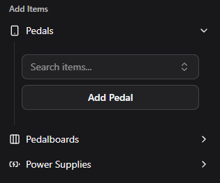
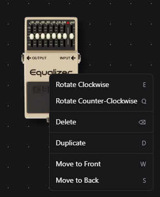
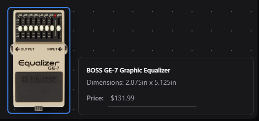
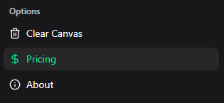
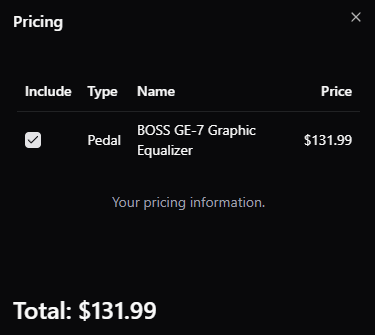
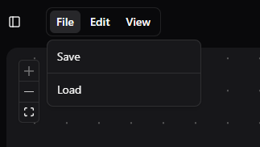

# Pedal Pricer v2.0

Pedal Pricer is a tool for guitar players to budget and plan guitar effects pedalboards. It was built using React and ASP.NET, and takes inspiration from the existing [pedalplayground.com](https://pedalplayground.com).

Try the site out for yourself [here](https://pedalpricer.com).

## Usage

Using Pedal Pricer is very simple.

First, add any item using the sidebar on the left.

To rotate, delete, duplicate, or layer the item you can right click it and select an option in the context menu.
The context menu also shows the respective keybinds for each action.

Pedal pricer allows you to assign prices to items that are currently in the canvas.

You can view the total price in the pricing tab.

In the pricing tab you can disable specific items to test different budget scenarios.

You can also import/export your setup by using the File dropdown.

## Local Setup
1. Clone the repo
2. Run `npm i`
3. Create a `.env.local` file and set VITE_BASE_API_URL.
4. Run `npm run dev`
